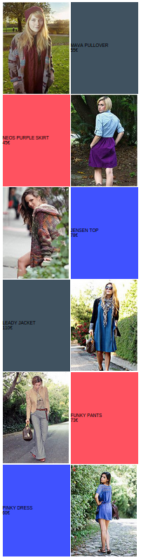
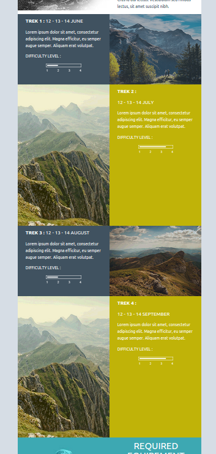

#PRODUCT LIST IN ZIGZAG 

This example show how with the loops you can repeat pieces of your template.

## Vars 

```php
"Vars" => array (
	'products' => [
			[
			'img' => 'http://191n.mj.am/img/191n/3s/x41.jpg',
			'name' => 'MAVA PULLOVER',
			'price' => '55€',
			'id' => 1		
			],[
			'img' => 'http://191n.mj.am/img/191n/3s/x4l.jpg',
			'name' => 'NEOS PURPLE SKIRT',
			'price' => '45€',
			'id' => 2
			],[
			'img' => 'http://191n.mj.am/img/191n/3s/x4m.jpg',
			'name' => 'JENSEN TOP',
			'price' => '78€',
			'id' => 3
			],
			[
			'img' => 'http://191n.mj.am/img/191n/3s/x42.jpg',
			'name' => 'LEADY JACKET',
			'price' => '110€',
			'id' => 4		
			],
			[
			'img' => 'http://191n.mj.am/img/191n/3s/x4p.jpg',
			'name' => 'FUNKY PANTS',
			'price' => '73€',
			'id' => 5
			],
			[
			'img' => 'http://191n.mj.am/img/191n/3s/x43.jpg',
			'name' => 'PINKY DRESS',
			'price' => '60€',
			'id' => 6
			]
	] 
    ),

```

## Template source

```html

	
	       	<tr>
			<td></td>
			<td style="background:#405260#ff5260#4052ff;">{{product.name}}<br>{{product.price}}</td>
		</tr>
	
		<tr>
			<td style="background:#405260#ff5260#4052ff;">{{product.name}}<br>{{product.price}}</td>
			<td></td>
		</tr>
	

```

## Result

###Simple example:

The placement of the image is switching between left and right.
The background color is rotating over 3 variants using the id of the product with the mod function of the templating language.
 


###Advanced example:




