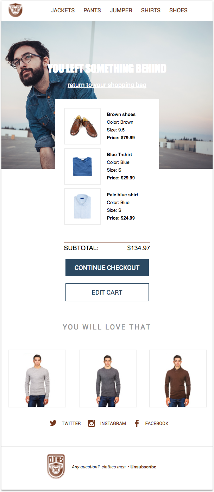
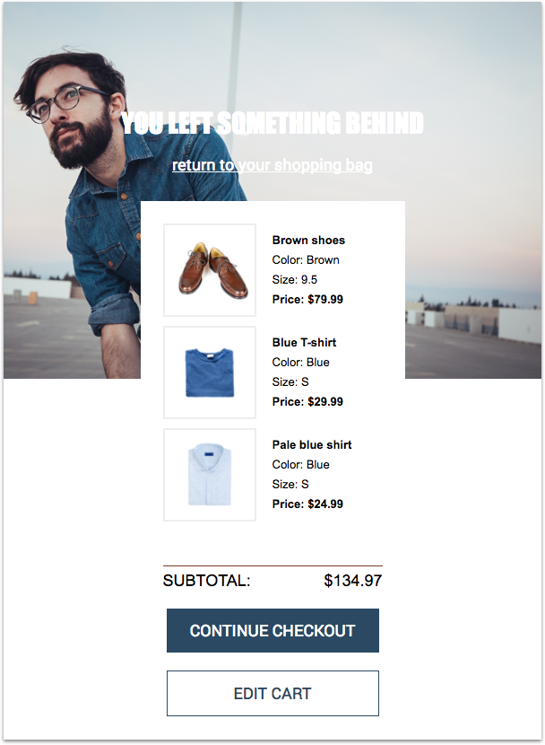

_Welcome to our templating language and MJML tutorials series. You can find all the tutorials [here](../README.md#lets-start-)_.

# How to create an abandoned cart email template

When a customer adds products to their cart but fails to check out, it doesn’t mean the sale is definitively over. Indeed, sending an email is a remarkably effective tactic to reduce your churn rate. Here are some numbers for you: 50% of abandoned cart emails are opened, and more than a third of them trigger clicks to redirect customers to the website.
In this tutorial, leveraging the power of our [templating language](http://dev.mailjet.com/template-language/reference/?utm_source=referrer&utm_medium=github&utm_campaign=tpl_lang_tutorial), we will show you how to create a customized abandoned cart email from a single template.

## Table of Contents

<ul>
  <li><a href="#prerequisites">Prerequisites</a></li>
  <li><a href="#what-will-you-achieve">What will you achieve?</a></li>
  <li>
    <a href="#time-to-code">Time to code!</a>
    <ul>
      <li><a href="#starting-with-a-simple-header">Starting with a simple header</a></li>
      <li>
        <a href="#sir-we-found-an-abandoned-cart">Sir, we found and abandoned cart.</a>
        <ul>
          <li><a href="#youre-my-hero">You're my hero!</a></li>
          <li><a href="#thats-my-cart">That's my cart!</a></li>
          <li><a href="#how-much-is-it">How much is it?</a></li>
          <li><a href="#click-click-click">Click, click, click.</a></li>
        </ul>
      </li>
      <li><a href="#you-will-love-that">You will love that</a></li>
      <li><a href="#the-social-network">The social network</a></li>
    </ul>
  </li>
  <li><a href="#conclusion">Conclusion</a></li>
</ul>


## Prerequisites

Obviously, you should have a [Mailjet](https://www.mailjet.com/?utm_source=referrer&utm_medium=github&utm_campaign=tpl_lang_tutorial) account. If you're not a client yet, you can [subscribe for a free account](https://app.mailjet.com/signup?utm_source=referrer&utm_medium=github&utm_campaign=tpl_lang_tutorial) (and send immediately up to 6,000 free emails a month!).

Some basic knowledge about [MJML](https://mjml.io/?utm_source=referrer&utm_medium=github&utm_campaign=tpl_lang_tutorial) is a plus, but isn't mandatory. MJML is an open source markup language making responsive email easy: you can catch its self-explanatory syntax based on rows (`<mj-section>`) and columns (`<mj-column>`) in a minute. If you prefer to code your email in HTML, we provide you with a ready-to-use `index.html` file that you can find at the root of this repository.You could also play with the code using the <a href="https://mjml.io/try-it-live">&nbsp;Try it live</a> links below the code snippets.

If you're a [MJML API](https://mjml.io/api?utm_source=referrer&utm_medium=github&utm_campaign=tpl_lang_tutorial) user (if not, join us, it's currently in [open beta](https://mjml.io/api?utm_source=referrer&utm_medium=github&utm_campaign=tpl_lang_tutorial)), you'll also be able to use our email sender tool we built especially for this tutorial. Go check the tool's [README](../email_sender/v0.1/) for more informations.

<br />

<a href="#table-of-contents">🔝</a>

<br />

## What will you achieve?

The well-known men clothing shop _clothes-men.mailjet.com_ has just hired you to create their new abandoned cart email template.

Their brief: you have to create a template that mainly displays...

* the items left in the cart
* some new articles the customer may be interested in

They provide you with a `variables.json` file, containing some mockup data.

Their designer, who has hosted all the assets online, has just sent you the final design:



Enough theory, it's time to write some code.

<br />

<a href="#table-of-contents">🔝</a>

<br />

## Time to code!

### Starting with a simple header

Let's implement the header. It is composed of the company logo and a navigation bar with links that lead to the website categories.


As you may notice in the code below, the main container is not a `<mj-section>` but a [`<mj-navbar>`](https://mjml.io/documentation/?utm_source=referrer&utm_medium=github&utm_campaign=tpl_lang_tutorial#mjml-navbar). Indeed, even if writing a template is a child's play with MJML, we can still ease this flow leveraging pre-made interactive components. Moreover, this component has been thought to be mobile-first, [behaving like a burger menu on compatible email clients](https://mjml.io/documentation/?utm_source=referrer&utm_medium=github&utm_campaign=tpl_lang_tutorial#mjml-navbar)!

This [`<mj-navbar>`](https://mjml.io/documentation/?utm_source=referrer&utm_medium=github&utm_campaign=tpl_lang_tutorial#mjml-navbar) is composed of two [`<mj-column>`](https://mjml.io/documentation/?utm_source=referrer&utm_medium=github&utm_campaign=tpl_lang_tutorial#mjml-column).

The first one contains a [`<mj-image>`](https://mjml.io/documentation/?utm_source=referrer&utm_medium=github&utm_campaign=tpl_lang_tutorial#mjml-image) that displays the logo.

The second [`<mj-column>`](https://mjml.io/documentation/?utm_source=referrer&utm_medium=github&utm_campaign=tpl_lang_tutorial#mjml-column) hosts a `<mj-inline-links>` component that will create your links based on a list of `<mj-link>` children. Way cleaner than a forest of `<a>` and `<table>`, right? A little of style customization with inline CSS attributes and a [`<mj-class>`](https://mjml.io/documentation/?utm_source=referrer&utm_medium=github&utm_campaign=tpl_lang_tutorial#mjml-attributes):

```XML
<mj-attributes>
  <mj-class name="nav-link" color="#763b26" font-size="20px" font-family="Roboto, Helvetica, Arial, sans-serif" />
</mj-attributes>

[...]

<!-- Navigation bar-->
<mj-navbar background-color="#ffffff">
  <mj-column width="80px" vertical-align="middle">
    <mj-image width="40px" src="https://s27.postimg.org/u09gkrbcz/logo_small.png" padding="10px"></mj-image>
  </mj-column>
  <mj-column width="520px" vertical-align="middle">
    <mj-inline-links
      hamburger="hamburger"
      base-url="#"
      align="center"
      ico-left="30px"
      ico-align="center"
      ico-font-size="40px"
      ico-color="#763b26"
      ico-padding-bottom="20px">
        <mj-link href="/jackets" mj-class="nav-link">JACKETS</mj-link>
        <mj-link href="/pants" mj-class="nav-link">PANTS</mj-link>
        <mj-link href="/jumper" mj-class="nav-link">JUMPER</mj-link>
        <mj-link href="/shirts" mj-class="nav-link">SHIRTS</mj-link>
        <mj-link href="/shoes" mj-class="nav-link">SHOES</mj-link>
    </mj-inline-links>
  </mj-column>
</mj-navbar>
```
<a href="https://mjml.io/try-it-live/r1M4vYzTl">&nbsp;Try it live</a>

<br />

<a href="#table-of-contents">🔝</a>

<br />

### Sir, we found an abandoned cart.

When their clients open the abandoned cart emails, _clothes-men.mailjet.com_ crew wants its customers to resume their shopping experience just where they left it. The best way to do it? Using a design very close to the original cart, let's reproduce it in our email with easy to identify CTAs that lead back to _clothes-men.mailjet.com_. As this design is a bit ambitious for an email, we'll have to use some MJML tricks to implement it the best way.



#### You're my hero!

First, as for our [welcome email template](../welcome), we have to implement a hero, i.e. an image (often inspirational) with some catchy text on it. If MJML provides us with an interactive component to do this job, the specific design forces us to use our imagination here.

As you can see, we're using two nested [`<mj-section>`](https://mjml.io/documentation/?utm_source=referrer&utm_medium=github&utm_campaign=tpl_lang_tutorial#mjml-section). This is because the MJML API we're using for this tutorial does not support yet the [`<mj-wrapper>`](https://mjml.io/documentation/?utm_source=referrer&utm_medium=github&utm_campaign=tpl_lang_tutorial#mjml-wrapper) component. If you're parsing your MJML code yourself, feel free to [play with it!](https://mjml.io/try-it-live/components/wrapper?utm_source=referrer&utm_medium=github&utm_campaign=tpl_lang_tutorial)

We're using our image as a background image, filling the `background-url` attribute. Then, in our first [`<mj-section>`](https://mjml.io/documentation/?utm_source=referrer&utm_medium=github&utm_campaign=tpl_lang_tutorial#mjml-section), we use two [`<mj-text>`](https://mjml.io/documentation/?utm_source=referrer&utm_medium=github&utm_campaign=tpl_lang_tutorial#mjml-text) to display our catchy sentences.

```XML
<!-- Hero + Cart -->
<mj-section
  padding-top="100px"
  background-url="https://s23.postimg.org/vwq5ctlln/hero.png"
  background-size="100%"
  background-repeat="no-repeat"
  background-color="#ffffff">
  <!-- Hero texts -->
  <mj-section vertical-align="middle">
    <mj-column>
      <mj-text
        padding="20px"
        color="#ffffff"
        font-family="Impact, Tahoma, Helvetica, Arial, sans-serif"
        align="center"
        font-size="30px"
        line-height="30px">
        YOU LEFT SOMETHING BEHIND
      </mj-text>
      <mj-text
        padding-bottom="30px"
        align="center"
        font-size="18px">
        <a href="#" style="color:#ffffff">return to your shopping bag</a>
      </mj-text>
    </mj-column>
  </mj-section>
  <!-- Cart -->
  <mj-section background-color="transparent">
    ...
```

<a href="https://mjml.io/try-it-live/SkvTY2oae">&nbsp;Try it live</a>

<br />

<a href="#table-of-contents">🔝</a>

<br />

#### That's my cart!

Let's focus now on the section section. It's a white card containing the cart itself plus the total and two buttons.

The cart is a list of items, whose data can be found in the `variables.json` file:

```JSON
{
"items": [
  {
    "title": "Brown shoes",
    "image_URL": "https://s13.postimg.org/r3otqmynn/shoes.png",
    "price": {
      "currency": "$",
      "separator": ".",
      "amount": 79.99
    },
    "size": "9.5",
    "color": "Brown"
  },
  {
    "title": "Blue T-shirt",
    "image_URL": "https://s13.postimg.org/onn0csgkz/t_shirt.png",
    "price": {
      "currency": "$",
      "separator": ".",
      "amount": 29.99
    },
    "size": "S",
    "color": "Blue"
  },
  {
    "title": "Pale blue shirt",
    "image_URL": "https://s13.postimg.org/shgglxxwz/shirt.png",
    "price": {
      "currency": "$",
      "amount": 24.99
    },
    "size": "S",
    "color": "Blue"
  }]
}
```

Using Mailjet's templating language [variables](http://dev.mailjet.com/template-language/reference/?utm_source=referrer&utm_medium=github&utm_campaign=tpl_lang_tutorial#variables), we can use this data and display it in our emails using the following pattern: `{{ var:property_key:default_value }}`.

Moreover, as this data is an array source, we can browse it to access each inner object using templating language `for` loops.

Start your `for` loops with a `` statement and end it with a `` statement. Within the loop, a new variable `single_element` is created and updated for each iteration, ready to be used.

See in the snippet below how we repeat the `<tr>` rows for every item and use its data in variables.

```XML
<!-- Cart -->
<mj-section background-color="transparent">
  <!-- Image -->
  <mj-column vertical-align="middle" width="295px" background-color="#ffffff" border="1px solid transparent">
    <!-- Item lists -->
    <mj-table padding="24px">
      
        <tr>
          <td width="120px" style="padding-bottom:10px">
            
          </td>
          <td width="120px" style="padding-bottom:10px">
            <strong>{{ item.title }}</strong><br />
            Color: {{ item.color }}<br />
            Size: {{ item.size }}<br />
            <strong>Price: {{ item.price.currency }}{{ item.price.amount }}</strong>
          </td>
        </tr>
      
    </mj-table>
    ...
```

As you may have noticed, we are using plain html tags instead of MJML ones. That's because you can't nest `<mj-column>` as certain email clients don't support it. When you have to create complex design, the best way is then to stick to the classic `<table>` children tags ( `<tr>`, `<td>`, `<th>`, etc.) wrapped in a [`<mj-table>`](https://mjml.io/documentation/?utm_source=referrer&utm_medium=github&utm_campaign=tpl_lang_tutorial#mjml-table) component.

<br />

<a href="https://mjml.io/try-it-live/SkvTY2oae">&nbsp;Try it live</a>

<br />

<a href="#table-of-contents">🔝</a>

<br />

#### How much is it?

Here again, we use a [`<mj-table>`](https://mjml.io/documentation/?utm_source=referrer&utm_medium=github&utm_campaign=tpl_lang_tutorial#mjml-table) to display two subcolumns. One is left-aligned and contains the `SUBTOTAL:` title, the other is right-aligned and displays the currency and the amount using two templating language [variables](http://dev.mailjet.com/template-language/reference/?utm_source=referrer&utm_medium=github&utm_campaign=tpl_lang_tutorial#variables).

```XML
<!-- Subtotal -->
<mj-table font-size="18px" padding="5px 24px 10px 24px">
  <tr><td>SUBTOTAL:</td><td style="text-align: right">{{ var:order.subtotal.currency }}{{ var:order.subtotal.amount }}</td></tr>
</mj-table>
```

<a href="https://mjml.io/try-it-live/SkvTY2oae">&nbsp;Try it live</a>

<br />

#### Click, click, click.

Last but not list, we display our two CTAs using two [`<mj-button>`](https://mjml.io/documentation/?utm_source=referrer&utm_medium=github&utm_campaign=tpl_lang_tutorial#mjml-button).

```XML
<!-- CTAs -->
<mj-button href="checkout" background-color="#2c4961" padding="10px">
  continue checkout
</mj-button>
<mj-button href="edit" background-color="#ffffff" border="1px solid #2c4961" color="#2c4961" padding="10px 0px 30px 0px">
  edit cart
</mj-button>
```

<a href="https://mjml.io/try-it-live/SkvTY2oae">&nbsp;Try it live</a>

<br />

<a href="#table-of-contents">🔝</a>

<br />

### You will love that

We've already covered that part in our previous tutorials. Want to discover how to implement this section? Go [this way](../receipt/#i-bet-you-want-to-buy-more-things).


### The social network

We've already covered that part in our previous tutorials. Want to discover how to implement this section? Go [this way](../welcome/#the-social-network).


## Conclusion

Here we are! Now, thanks to your very cool and practical abandoned cart email, no cart on your website will be left in despair, longing forever for their customer to come back. Thank you for them!

We'd love to have your feedback about this first tutorial, so ping us on [Twitter](https://twitter.com/mailjetdev) or come and chat on the [MJML slack channel](https://slack.mjml.io/?utm_source=referrer&utm_medium=github&utm_campaign=tpl_lang_tutorial)!

You want to be informed about other tutorials and nice tech articles? Subscribe to our [dev only newsletter](https://dev.mailjet.com/community/?utm_source=referrer&utm_medium=github&utm_campaign=tpl_lang_tutorial#newsletter) to stay tuned!

<br />

<a href="#table-of-contents">🔝</a>
