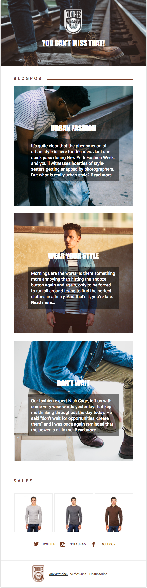
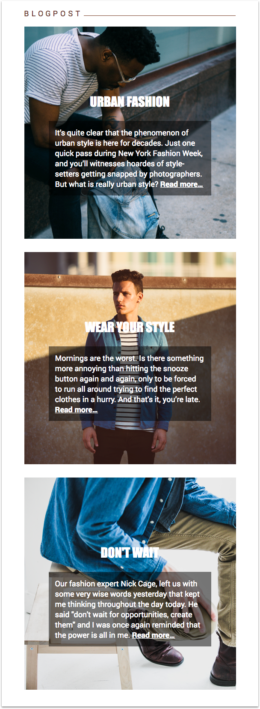
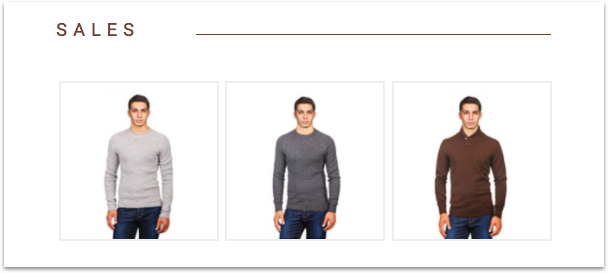

_Welcome to our templating language and MJML tutorials series. You can find all the tutorials [here](../README.md#lets-start-)_.
# How to create an digest email template

A digest email is a summary sent on a regular basis (daily or weekly, for instance). These emails convey information in a “digestible” way, mimicking paper publications such as the old popular Reader’s Digest.This format is fast and convenient to read and, therefore, very well received by users.<br/>
In this tutorial, leveraging the power of our [templating language](http://dev.mailjet.com/template-language/reference/?utm_source=referrer&utm_medium=github&utm_campaign=tpl_lang_tutorial), we will show you how to create a customized digest email from a single template.

## Table of Contents

<ul>
  <li><a href="#prerequisites">Prerequisites</a></li>
  <li><a href="#what-will-you-achieve">What will you achieve?</a></li>
  <li>
    <a href="#time-to-code">Time to code!</a>
    <ul>
      <li><a href="#we-need-a-hero">We need a hero!</a></li>
      <li><a href="#the-perfect-content-handcrafted-just-for-you">The perfect content handcrafted just for you</a></li>
      <li><a href="#sales-because-we-really-want-you-to-buy-these-things">Sales! (Because we really want you to buy these things)</a></li>
      <li><a href="#facebook-instagram-twitter-and-consorts">Facebook, Instagram, Twitter and consorts...</a></li>
    </ul>
  </li>
  <li><a href="#conclusion">Conclusion</a></li>
</ul>


## Prerequisites

Obviously, you should have a [Mailjet](https://www.mailjet.com/?utm_source=referrer&utm_medium=github&utm_campaign=tpl_lang_tutorial) account. If you're not a client yet, you can [subscribe for a free account](https://app.mailjet.com/signup?utm_source=referrer&utm_medium=github&utm_campaign=tpl_lang_tutorial) (and send immediately up to 6,000 free emails a month!).

Some basic knowledge about [MJML](https://mjml.io/?utm_source=referrer&utm_medium=github&utm_campaign=tpl_lang_tutorial) is a plus, but isn't mandatory. MJML is an open source markup language making responsive email easy: you can catch its self-explanatory syntax based on rows (`<mj-section>`) and columns (`<mj-column>`) in a minute. If you prefer to code your email in HTML, we provide you with a ready-to-use `index.html` file that you can find at the root of this repository.You could also play with the code using the <a href="https://mjml.io/try-it-live">&nbsp;Try it live</a> links below the code snippets.

If you're a [MJML API](https://mjml.io/api?utm_source=referrer&utm_medium=github&utm_campaign=tpl_lang_tutorial) user (if not, join us, it's currently in [open beta](https://mjml.io/api?utm_source=referrer&utm_medium=github&utm_campaign=tpl_lang_tutorial)), you'll also be able to use our email sender tool we built especially for this tutorial. Go check the tool's [README](../email_sender/v0.1/) for more informations.

<br />

<a href="#table-of-contents">🔝</a>

<br />

## What will you achieve?

The well-known men clothing shop _clothes-men.mailjet.com_ has just hired you to create their new digest email template.

Their brief: you have to create a template that mainly displays...

* a catchy hero to grab their customers' attention
* a list of blogposts curated for a specific user
* an optional sales section that is displayed if the user hasn't opened a marketing campaign in the last 30 days

They provide you with a `variables.json` file, containing some mockup data.

Their designer, who has hosted all the assets online, has just sent you the final design:



Enough theory, it's time to write some code.

<br />

<a href="#table-of-contents">🔝</a>

<br />

## Time to code!

### We need a hero!

When their clients open the welcome emails, _clothes-men.mailjet.com_ wants to catch their attention immediately. A hero is a nice way to display catchy text and image. Let's see how we could implement it.


MJML provides us with an interactive component, [`<mj-hero>`](https://mjml.io/documentation/?utm_source=referrer&utm_medium=github&utm_campaign=tpl_lang_tutorial#transactional-templating#mjml-hero) that will do the job for us. We just need to set some `background-*` attributes, then add some content and voilà! Could it be simpler?

```XML
<!-- Hero -->
<mj-hero
  mode="fixed-height"
  background-width="600px"
  background-height="256px"
  background-url="https://s23.postimg.org/syrzvegqj/hero.png"
  padding="50px 0px">
  <mj-hero-content width="75%">
    <mj-image src="https://s30.postimg.org/7pzr51wrl/logo-clothes-white.png" alt="Clothes Men Logo"/>
    <mj-text mj-class="big-white-title" padding="20px">
      YOU CAN'T MISS THAT!
    </mj-text>
  </mj-hero-content>
</mj-hero>
```
<a href="https://mjml.io/try-it-live/rk-tkNICx">&nbsp;Try it live</a>

<br />

<a href="#table-of-contents">🔝</a>

<br />

### The perfect content handcrafted just for you

What would be a digest without content? But cool content isn't enough. It has to be content specially curated for each user. They have to feel unique. _clothes-men.mailjet.com_ handles the backend algorithms that provide you with this content, but relies on you to build the customization logic in your template. Here's the data in JSON format as you can find it in `variables.json`:

```JSON
"blogposts": [
  {
    "title": "URBAN FASHION",
    "content": "It’s quite clear that the phenomenon of urban style is here for decades. Just one quick pass during New York Fashion Week, and you’ll witnesses hoardes of style-setters getting snapped by photographers. But what is really urban style?",
    "image_URL": "https://s30.postimg.org/b8xytfuo1/main1.png"
  },
  {
    "title": "WEAR YOUR STYLE",
    "content": "Mornings are the worst. Is there something more annoying than hitting the snooze button again and again, only to be forced to run all around trying to find the perfect clothes in a hurry. And that's it, you’re late.",
    "image_URL": "https://s30.postimg.org/iq768nk75/main2.png"
  },
  {
    "title": "DON'T WAIT",
    "content": "Our fashion expert Nick Cage, left us with some very wise words yesterday that kept me thinking throughout the day today. He said \"don't wait for opportunities, create them\" and I was once again reminded that the power is all in me.",
    "image_URL": "https://s30.postimg.org/utchw7v9d/main3.png"
  }
]
```

To exploit this array of objects, Mailjet templating language enables you use [loops](http://dev.mailjet.com/template-language/reference/?utm_source=referrer&utm_medium=github&utm_campaign=tpl_lang_tutorial#transactional-templating#loop-statements). and [variables](http://dev.mailjet.com/template-language/reference/?utm_source=referrer&utm_medium=github&utm_campaign=tpl_lang_tutorial#transactional-templating#variables).

In the snippet below, let's try to spot loops and variables.

```XML
<!-- Blogposts -->
<mj-raw>
  
</mj-raw>
<mj-section
  padding="160px 0px 132px 0px"
  background-url="{{ blogpost.image_URL }}"
  background-repeat="no-repeat"
  background-color="#ffffff">
  <mj-column width="380px">
    <mj-text mj-class="big-white-title">
      {{ blogpost.title }}
    </mj-text>
    <mj-text mj-class="black-card">
      {{ blogpost.content }}
      <a href="#" style="font-weight: bold; color:#ffffff;"> Read more…</a>
    </mj-text>
  </mj-column>
</mj-section>
<mj-raw>
  
</mj-raw>
```

You've seen it! The loop iterates over the `blogposts` array and creates each time a new variable named `blogpost`.

The code contained between the `` and `` is then repeated for each element of the array. And you can access the properties using the `{{ variable.property }}` syntax.

Note that, to use templating language [`for` loops](http://dev.mailjet.com/template-language/reference/?utm_source=referrer&utm_medium=github&utm_campaign=tpl_lang_tutorial#transactional-templating#loop-statements) with MJML, __you have to wrap your instructions in [`<mj-raw>`](https://mjml.io/documentation/?utm_source=referrer&utm_medium=github&utm_campaign=tpl_lang_tutorial#transactional-templating#mjml-raw) tags__ so MJML doesn't remove them when transpiling to HTML.


The result, three sections, top down, displaying a cool image as a background, plus a catchy title and summary to make them feel like to click on the link!



<a href="https://mjml.io/try-it-live/rkKgg480e">&nbsp;Try it live</a>

<br />

<a href="#table-of-contents">🔝</a>

<br />

### Sales! (Because we really want you to buy these things)

The last marketing campaign of _clothes-men.mailjet.com_ was quite a success with an open rate up to 50%. But, as they do know that [transactional messages are opened from 2 to 5 times more than marketing email](https://www.mailjet.com/blog/transactional-emails/how-to-take-transactional-email-to-the-next-level-with-our-transactional-suite), they want to benefit from this situation and try to sell their products to the other 50% without annoying the one who already opened the campaign.



Mailjet's templating language comes to the rescue with [conditional statements](https://dev.mailjet.com/template-language/reference/#conditional-statements) and [built-in functions](http://dev.mailjet.com/template-language/reference/?utm_source=referrer&utm_medium=github&utm_campaign=tpl_lang_tutorial#transactional-templating#functions). The `HasOpenedSince(number_of_days)` function especially comes in handy for our matter. If the user hasn't opened any marketing campaign for the last 30 days, the piece of code contained between `` and `` will be displayed. A good chance to trigger more sells, while the aficionados won't feel being spammed. Isn't it a win-win situation? 😎

```XML
<!-- Sales Title -->
<mj-raw>
  
</mj-raw>
  <mj-section
    padding="40px 0px 20px 0px"
    background-color="#ffffff">
    <mj-column width="140px">
      <mj-text color="#753f37" font-size="18px" letter-spacing="6px">
        SALES
      </mj-text>
    </mj-column>
    <mj-column width="355px">
      <mj-divider mj-class="divider-simple" width="100%" padding="16px 0 0 0" />
    </mj-column>
  </mj-section>


  <!-- Suggestions -->
  <mj-section mj-class="section-white" padding="16px 50px 20px 50px">
    <mj-raw>
      
    </mj-raw>
    <!-- Careful with the number of suggestions! -->
      <mj-column>
        <mj-image
          padding="5px"
          mj-class="img-bordered"
          src="{{ suggestion.image_URL }}"
          href="{{ suggestion.link }}"
          alt="{{ suggestion.title }}"
        />
      </mj-column>
    <mj-raw>
      
    </mj-raw>
  </mj-section>
<mj-raw>
  
</mj-raw>
```

<a href="https://mjml.io/try-it-live/HJdueNIRg">&nbsp;Try it live</a>

<br />

<a href="#table-of-contents">🔝</a>

<br />


### Facebook, Instagram, Twitter and consorts...

We've already covered that part in our previous tutorials. Want to discover how to implement this section? Go [this way](../welcome/#the-social-network).


## Conclusion

Here we are! Now, thanks to your very cool and practical digest email, _clothes-men.mailjet.com_ readers will love reading company's blogposts that look like they've been written for them only.

We'd love to have your feedback about this tutorial, so ping us on [Twitter](https://twitter.com/mailjetdev) or come and chat on the [MJML slack channel](https://slack.mjml.io/?utm_source=referrer&utm_medium=github&utm_campaign=tpl_lang_tutorial)!

You want to be informed about other tutorials and nice tech articles? Subscribe to our [dev only newsletter](https://dev.mailjet.com/community/?utm_source=referrer&utm_medium=github&utm_campaign=tpl_lang_tutorial#newsletter) to stay tuned!

<br />

<a href="#table-of-contents">🔝</a>
