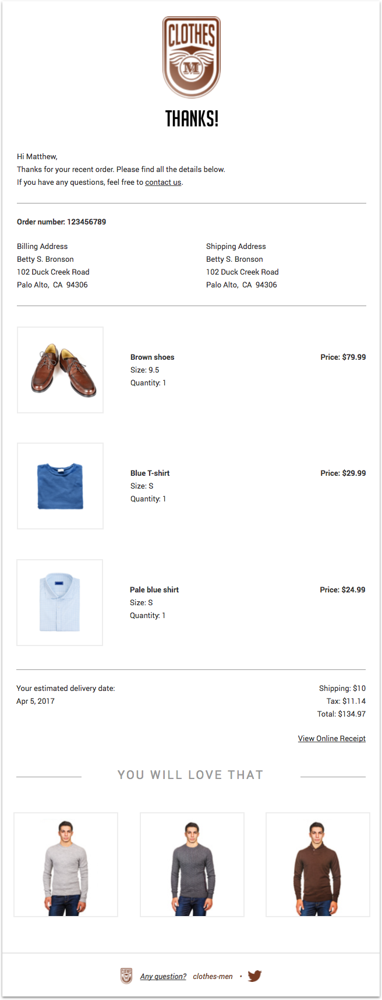
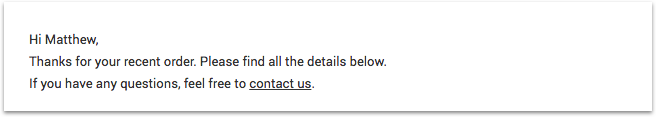
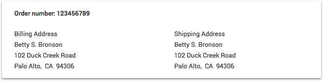
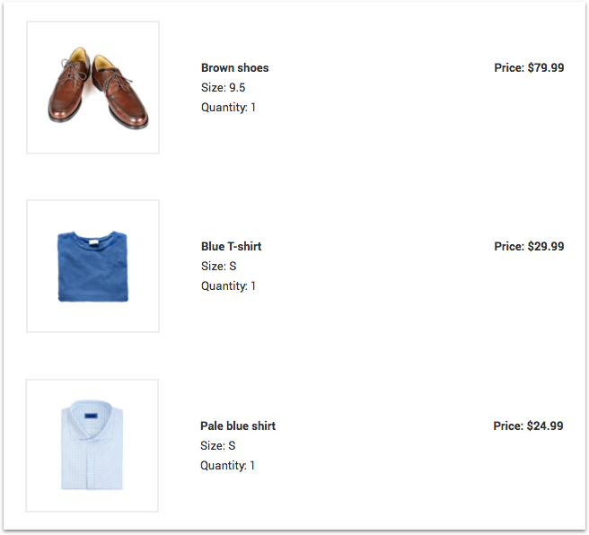
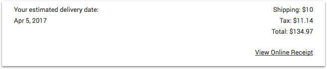
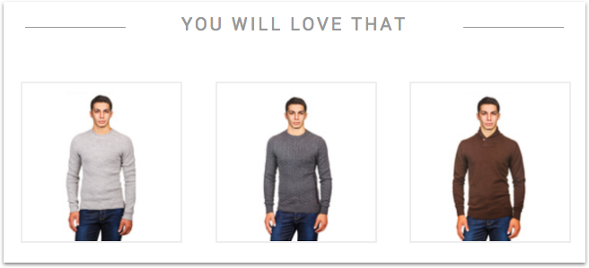

# How to create an e-receipt email template

From online shoe stores to indie music platforms, any company selling products online will have to send a receipt. In this tutorial, we're going to show you how to code an e-receipt email template step by step using [MJML](https://mjml.io?utm_source=referrer&utm_medium=github&utm_campaign=tpl_lang_tutorial) and [Mailjet's templating language](http://dev.mailjet.com/template-language/?utm_source=referrer&utm_medium=github&utm_campaign=tpl_lang_tutorial).

## Table of Contents

<ul>
  <li><a href="#prerequisites">Prerequisites</a></li>
  <li>
    <a href="#what-will-you-achieve">What will you achieve?</a>
    <ul>
      <li><a href="#starting-with-a-simple-header">Starting with a simple header</a></li>
      <li><a href="#be-polite-say-hi">Be polite. Say hi.</a></li>
      <li><a href="#where-should-we-deliver">Where should we deliver?</a></li>
      <li><a href="#looping-over-items-data">Looping over items data</a></li>
      <li><a href="#ok-but-your-loop-does-nothing">OK, but your loop does nothing...</a></li>
      <li><a href="#wow-this-is-quite-expensive">Wow, this is quite expensive!</a></li>
      <li><a href="#i-bet-you-want-to-buy-more-things">I bet you want to buy more things!</a></li>
      <li><a href="#because-we-saved-the-best-for-last">Because we saved the best for last</a></li>
    </ul>
  </li>
  <li><a href="#time-to-code">Time to code!</a></li>
  <li><a href="#conclusion">Conclusion</a></li>
</ul>

## Prerequisites

Obviously, you should have a [Mailjet](https://www.mailjet.com/?utm_source=referrer&utm_medium=github&utm_campaign=tpl_lang_tutorial) account. If you're not a client yet, you can [subscribe for a free account](https://app.mailjet.com/signup?utm_source=referrer&utm_medium=github&utm_campaign=tpl_lang_tutorial) (and send immediately up to 6,000 free emails a month!). __Warning:__ you have to show clean hands when you subscribe, because we have a strong anti-spammer policy.

Some basic knowledge about [MJML](https://mjml.io/?utm_source=referrer&utm_medium=github&utm_campaign=tpl_lang_tutorial) is a plus, but isn't mandatory. MJML is an open source markup language making responsive email easy: you can catch its self-explanatory syntax based on rows (`<mj-section>`) and columns (`<mj-column>`) in a minute. If you prefer to code your email in HTML, we provide you with a ready-to-use `index.html` file that you can find at the root of this repository.You could also play with the code using the <a href="https://mjml.io/try-it-live">&nbsp;Try it live</a> links below the code snippets.

If you're a [MJML API](https://mjml.io/api) user (if not, join us, it's currently in [open beta](https://mjml.io/api?utm_source=referrer&utm_medium=github&utm_campaign=tpl_lang_tutorial)), you'll also be able to use our email sender tool we built especially for this tutorial. Go check the tool's [README](../email_sender/v0.1/) for more informations.

<br />

<a href="#table-of-contents">🔝</a>

<br />

## What will you achieve?

The well-known men clothing shop _clothes-men.mailjet.com_ has just hired you to create their new e-receipt template email.

Their brief: you have to create a template that displays...

* all the items bought by their customer
* the purchase informations (billing and delivery address, order number, full price with VAT)
* a list of new items to trigger more sales

They provide you with a `variables.json` file, containing some mockup data.

Their designer, who has hosted all the assets online, has just sent you the final design:



Are you ready to start? Let's go!

<br />

<a href="#table-of-contents">🔝</a>

<br />

## Time to code!

### Starting with a simple header

First of all, you need to implement the header, composed of two images, a logo and a thanks word.


The layout you need here is very basic: two [`<mj-image>`](https://mjml.io/documentation/?utm_source=referrer&utm_medium=github&utm_campaign=tpl_lang_tutorial#mjml-image) (which behave as blocks and are centered by default), in a single [`<mj-column>`](https://mjml.io/documentation/?utm_source=referrer&utm_medium=github&utm_campaign=tpl_lang_tutorial#mjml-column).

Adjust the padding as desired with the `padding-top` attribute.

Don't forget the `alt` attribute, used if [your images aren't displayed by the email clients](https://litmus.com/blog/the-ultimate-guide-to-styled-alt-text-in-email).

<br />

```XML
<!-- Logo -->
<mj-section mj-class="section-white" padding-top="30px">
  <mj-column>
    <mj-image src="https://s13.postimg.org/6d1pbbkdv/logo.png" width="100px" alt="logo"/>
    <mj-image src="https://s13.postimg.org/p1occe0oj/thanks.png" width="90px" alt="thanks!" padding-top="20px"/>
  </mj-column>
</mj-section>
```
<a href="https://mjml.io/try-it-live/SkqnJXYnx">&nbsp;Try it live</a>

<br />

<a href="#table-of-contents">🔝</a>

<br />

### Be polite. Say hi.

You are coding a transactional email template, a one-to-one conversation between _clothes-men.mailjet.com_ and one of their customer. So let's greet them personally.



Mailjet templating language enables you to use [variables](http://dev.mailjet.com/template-language/reference/?utm_source=referrer&utm_medium=github&utm_campaign=tpl_lang_tutorial#variables) to personalize your template with custom data.

Remember the `variables.json` file you have been provided with? You can refer to its values directly from your template using the following pattern: `{{ var:property_key:default_value }}`.

Here, you're interested in the `user.name` property, whose value is `Matthew` for this example. Your variable placeholder is then `{{ var:user.name }}`.

Let's put this placeholder along to the rest of your text in a [`<mj-text>`](https://mjml.io/documentation/?utm_source=referrer&utm_medium=github&utm_campaign=tpl_lang_tutorial#mjml-text) tag, left aligned by default. Note that you can use plain HTML tags, such as `<br />` and `<a>` inside a [`<mj-text>`](https://mjml.io/documentation/?utm_source=referrer&utm_medium=github&utm_campaign=tpl_lang_tutorial#mjml-text).

<br />

```XML
<!-- Hi and Thanks -->
<mj-section mj-class="section-white" padding-top="30px">
  <mj-column>
    <mj-text>
      Hi {{ var:user.name }},<br />
      Thanks for your recent order. Please find all the details below.<br />
      If you have any questions, feel free to <a href="mailto:contact@clothes-men.mailjet.com">contact us</a>.
    </mj-text>
  </mj-column>
</mj-section>
```
<a href="https://mjml.io/try-it-live/HkjWWmKhe">&nbsp;Try it live</a>

<br />

<a href="#table-of-contents">🔝</a>

<br />

### Where should we deliver?

Now, it's time to display the order number and the billing and delivery addresses.



The layout you should use here is divided into two sections.

The first one contains a single column and a single [`<mj-text>`](https://mjml.io/documentation/?utm_source=referrer&utm_medium=github&utm_campaign=tpl_lang_tutorial#mjml-text) element. It uses a templating language variable to display the order number.

The latter uses two columns. If you don't provide a specific width, they adopt their default behavior and share the available space equally between each other, i.e. 50% of their parent container. Let's look at the [templating language variables](http://dev.mailjet.com/template-language/reference/?utm_source=referrer&utm_medium=github&utm_campaign=tpl_lang_tutorial#variables) used here. As you can see, you can dive deeply into a JSON representation to find the value you need and display it along with regular static text.

<br />

```XML
<!-- Order number -->
<mj-section mj-class="section-white">
  <mj-column>
    <mj-text>
      <strong>Order number: {{ var:order.number }}</strong>
    </mj-text>
  </mj-column>
</mj-section>

<!-- Billing and Shipping addresses -->
<mj-section mj-class="section-white">
  <mj-column>
    <mj-text>
      Billing Address<br />
      {{ var:user.address.billing_address.full_name }}<br />
      {{ var:user.address.billing_address.address_line_1 }}<br />
      {{ var:user.address.billing_address.city }},&nbsp;
      {{ var:user.address.billing_address.state }}&nbsp;
      {{ var:user.address.billing_address.postal_code }}
    </mj-text>
  </mj-column>
  <mj-column>
    <mj-text>
      Shipping Address<br />
      {{ var:user.address.billing_address.full_name }}<br />
      {{ var:user.address.billing_address.address_line_1 }}<br />
      {{ var:user.address.billing_address.city }},&nbsp;
      {{ var:user.address.billing_address.state }}&nbsp;
      {{ var:user.address.billing_address.postal_code }}
    </mj-text>
  </mj-column>
</mj-section>
```
<a href="https://mjml.io/try-it-live/Skrg-7Y3g">&nbsp;Try it live</a>

<br />

<a href="#table-of-contents">🔝</a>

<br />

### Looping over items data

As reproduced below, the mockup data contains an `items` array with three object children. But _clothes-men.mailjet.com_ customers won't buy a fix amount of items every time! You need a way to iterate over this data safely, and display an items list whatever their number.

<br />

```JSON
"items": [
  {
    "title": "Brown shoes",
    "image_URL": "https://s13.postimg.org/r3otqmynn/shoes.png",
    "price": {
      "currency": "$",
      "separator": ".",
      "amount": 79.99
    },
    "size": "9.5",
    "quantity": 1
  },
  {
    "title": "Blue T-shirt",
    "image_URL": "https://s13.postimg.org/onn0csgkz/t_shirt.png",
    "price": {
      "currency": "$",
      "separator": ".",
      "amount": 29.99
    },
    "size": "S",
    "quantity": 1
  },
  {
    "title": "Pale blue shirt",
    "image_URL": "https://s13.postimg.org/shgglxxwz/shirt.png",
    "price": {
      "currency": "$",
      "amount": 24.99
    },
    "size": "S",
    "quantity": 1
  }
]
```

<br />

That's when templating language `for` loops come in handy.

Start your `for` loops with a `` statement.

End it with a `` statement.

Within the loop, a new variable `single_element` is created and updated for each iteration. You'll learn right after how to access it.

Note that, to use templating language [`for` loops](http://dev.mailjet.com/template-language/reference/?utm_source=referrer&utm_medium=github&utm_campaign=tpl_lang_tutorial#loop-statements) with MJML, __you have to wrap your instructions in [`<mj-raw>`](https://mjml.io/documentation/?utm_source=referrer&utm_medium=github&utm_campaign=tpl_lang_tutorial#mjml-raw) tags__ so MJML doesn't remove them when transpiling to HTML.

<br />

```XML
<mj-raw>
  
</mj-raw>
  <mj-section mj-class="section-white" vertical-align="middle">
    ...
  </mj-section>
<mj-raw>
  
</mj-raw>
```
<a href="https://mjml.io/try-it-live/HykGMmY3l">&nbsp;Try it live</a>

<br />

<a href="#table-of-contents">🔝</a>

<br />

### OK, but your loop does nothing...

Indeed, before you can boast of being the king of the loops in email, you should at least display some content! Here's what should look like a single item.


In the [`for` loop](http://dev.mailjet.com/template-language/reference/?utm_source=referrer&utm_medium=github&utm_campaign=tpl_lang_tutorial#loop-statements), you will use a [`<mj-section>`](https://mjml.io/documentation/?utm_source=referrer&utm_medium=github&utm_campaign=tpl_lang_tutorial#mjml-section) for each item.

Each section is composed of three columns, displaying item's picture, infos (title, size, quantity) and price respectively. The two latter are grouped with a [`<mj-group>`](https://mjml.io/documentation/?utm_source=referrer&utm_medium=github&utm_campaign=tpl_lang_tutorial#mjml-group) to align them vertically with the column containing the image.

Because you named your child element `item`, you can access the object properties directly using this syntax: `{{ item.property_key }}`.

For instance, the [`<mj-image>`](https://mjml.io/documentation/?utm_source=referrer&utm_medium=github&utm_campaign=tpl_lang_tutorial#mjml-image) `src` attribute will be dynamically updated for each iteration with the correct `image_URL` property.

The `item` variable follows the same rules as other templating language variables, so you can add default values and dive deeply into their values (and use another `for` loop if these values are arrays!).

<br />

```XML
<mj-section mj-class="section-white" vertical-align="middle">
  <!-- Image -->
  <mj-column vertical-align="middle" width="30%">
    <mj-image
      padding="25px"
      align="left"
      mj-class="img-bordered"
      src="{{ item.image_URL }}"
      alt="{{ item.title }}"
      width="150px"
    />
  </mj-column>
  <!-- Data -->
  <mj-group vertical-align="middle" width="70%">
    <mj-column>
      <mj-text align="left">
        <strong>{{ item.title }}</strong><br />
        Size: {{ item.size }}<br />
        Quantity: {{ item.quantity }}
      </mj-text>
    </mj-column>
    <!-- Price -->
    <mj-column>
      <mj-text align="right">
        <strong>Price: {{ item.price.currency }}{{ item.price.amount }}</strong>
      </mj-text>
    </mj-column>
  </mj-group>
</mj-section>
```
<a href="https://mjml.io/try-it-live/HykGMmY3l">&nbsp;Try it live</a>

<br />

Now that you have implemented a single item, let's see what is the result when the [`for` loop](http://dev.mailjet.com/template-language/reference/?utm_source=referrer&utm_medium=github&utm_campaign=tpl_lang_tutorial#loop-statements) is executed and the template rendered:



Pretty neat, isn't it?

<br />

<a href="#table-of-contents">🔝</a>

<br />

### Wow, this is quite expensive!

The bill please! You have to implement a detailed total price with shipping, taxes and total amount values. Problem, you have been provided only with two of these values and the taxes amount is missing.



Well, if you look closely to the `variables.json` file, you'll find a `order.sales_taxes_percentage` property, whose value is `0.0825` (i.e. 8.25%).

You're out of danger! Using [templating language arithmetics](http://dev.mailjet.com/template-language/reference/?utm_source=referrer&utm_medium=github&utm_campaign=tpl_lang_tutorial#operators) and [built-in functions](http://dev.mailjet.com/template-language/reference/?utm_source=referrer&utm_medium=github&utm_campaign=tpl_lang_tutorial#functions), calculating the taxes amount is a child's play!

First, to apply the percentage, some very basic math:<br/>*total_amount* __*__ *taxes_percentage* __=>__ 134.97 * 0.0825 __=__ 11.135025.

Very convenient, isn't it? And of course, because you don't want to display more that two figures after the dot, you can use the `Round(n, precision)` function to perfect the display!

<br />

```XML
<!-- Delivery date and Total amount -->
<mj-section mj-class="section-white">
  <mj-column width="66%">
    <mj-text>
      Your estimated delivery date:<br />
      {{ var:order.delivery_date }}
    </mj-text>
  </mj-column>
  <mj-column width="34%">
    <mj-text align="right">
      Shipping: {{ var:order.shipping.currency }}{{ var:order.shipping.amount }}<br />
      Tax: {{ var:order.total.currency }}{{ Round(var:order.total.amount * var:order.sales_taxes_percentage, 2) }}<br />
      Total: {{ var:order.total.currency }}{{ var:order.total.amount }}
    </mj-text>
    <mj-text align="right">
      <a href="#View_Online_Receipt" target="_blank">View Online Receipt</a>
    </mj-text>
  </mj-column>
</mj-section>
```
<a href="https://mjml.io/try-it-live/rJF-97K2g">&nbsp;Try it live</a>

<br />

<a href="#table-of-contents">🔝</a>

<br />

### I bet you want to buy more things!

Because, let's be fair, _clothes-men.mailjet.com_ wants to sell them more... They ask you to display a fix amount of suggestions, and provide you with some array data in the `variables.json` file. You're now a [`for` loop](http://dev.mailjet.com/template-language/reference/?utm_source=referrer&utm_medium=github&utm_campaign=tpl_lang_tutorial#loop-statements) expert, so this is not a problem anymore!



Note that this time, the [`<mj-raw>`](https://mjml.io/documentation/?utm_source=referrer&utm_medium=github&utm_campaign=tpl_lang_tutorial#mjml-raw) is wrapping the column. That's a good idea for a fixed number of columns, but what will happen if we have more? Use your imagination! The solution is behind the scope of this tutorial, but if you want to chat about it, [join the MJML slack](https://slack.mjml.io/?utm_source=referrer&utm_medium=github&utm_campaign=tpl_lang_tutorial) ;)

<br />

```XML
<!-- You will love that Divider -->
<mj-section mj-class="section-white" padding-top="30px">
  <mj-column width="25%">
      <mj-divider mj-class="divider-simple" />
  </mj-column>
  <mj-column width="50%">
      <mj-text font-size="20" padding="0px" align="center" color="#999999">
        <span style="letter-spacing:3px">YOU WILL LOVE THAT</span>
      </mj-text>
  </mj-column>
  <mj-column width="25%">
      <mj-divider mj-class="divider-simple" />
  </mj-column>
</mj-section>

<!-- Suggestions -->
<mj-section mj-class="section-white" padding-top="30px">
  <mj-raw>
    
  </mj-raw>
  <!-- Careful with the number of suggestions! -->
    <mj-column>
      <mj-image
        padding="20px"
        mj-class="img-bordered"
        src="{{ suggestion.image_URL }}"
        href="{{ suggestion.link }}"
        alt="{{ suggestion.title }}"
      />
    </mj-column>
  <mj-raw>
    
  </mj-raw>
</mj-section>
```
<a href="https://mjml.io/try-it-live/H11KfQYhe">&nbsp;Try it live</a>

<br />

<a href="#table-of-contents">🔝</a>

<br />

### Because we saved the best for last

Let's finish by a simple footer.


The trick here is that you want to prevent the columns from stacking on mobile. A [`<mj-group>`](https://mjml.io/documentation/?utm_source=referrer&utm_medium=github&utm_campaign=tpl_lang_tutorial#mjml-group) is then the solution. More info in the [official documentation](https://mjml.io/documentation/?utm_source=referrer&utm_medium=github&utm_campaign=tpl_lang_tutorial).

<br />

```XML
<mj-section mj-class="section-white" vertical-align="middle" padding-bottom="30px">
  <mj-group>
    <mj-column width="31%" vertical-align="middle">
      <mj-image src="https://s13.postimg.org/6d1pbbkdv/logo.png" width="20px" alt="logo" align="right"/>
    </mj-column>
    <mj-column width="38%" vertical-align="middle">
      <mj-text align="center" font-style="italic" padding="0">
        <a href="clothes-men.mailjet.com/questions" target="_blank">Any question?</a>&nbsp;
        <a href="clothes-men.mailjet.com" target="_blank" style="color: #763b26; text-decoration: none">clothes-men</a>
        <span style="color: #763b26">&nbsp;•</span>
      </mj-text>
    </mj-column>
    <mj-column width="31%" vertical-align="middle">
      <mj-image src="https://s24.postimg.org/3m7nc9qad/twitter.png" width="25px" alt="logo" align="left"/>
    </mj-column>
  </mj-group>
</mj-section>
```
<a href="#">&nbsp;Try it live</a>

<br />

<a href="#table-of-contents">🔝</a>

<br />


## Conclusion

Hoorah! You've just implemented your first email with Mailjet templating language and MJML. We hope you've learned a lot.

You were a beginner? See how email coding is now easier than ever!<br />
More of an email veteran? How does it feel compared to your usual coding workflow?

We'd love to have your feedback about this first tutorial, so ping us on [Twitter](https://twitter.com/mailjetdev) or come and chat on the [MJML slack channel](https://slack.mjml.io/?utm_source=referrer&utm_medium=github&utm_campaign=tpl_lang_tutorial)!

You want to be informed about other tutorials and nice tech articles? Subscribe to our [dev only newsletter](https://dev.mailjet.com/community/?utm_source=referrer&utm_medium=github&utm_campaign=tpl_lang_tutorial#newsletter) to stay tuned!

<br />

<a href="#table-of-contents">🔝</a>
