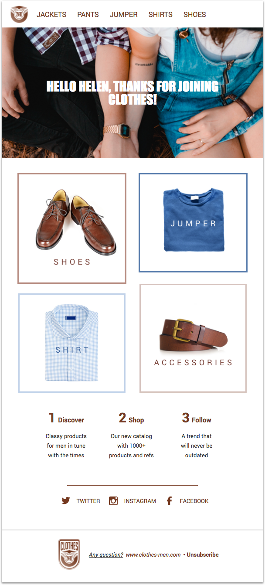
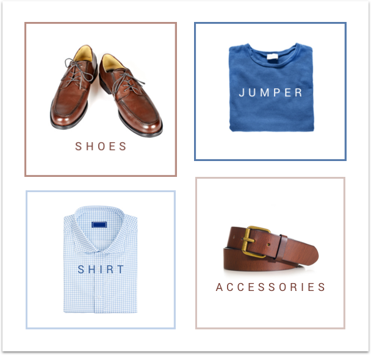

# How to create a welcome email template

Welcome emails are a powerful way to communicate with your users, because they expect to be greeted when they subscribe to your website. It is then important to welcome they warmly, and, most-of-all, personally. We can see you starting to panic: you can't write a dedicated template for each of them... Don’t freak out! In this tutorial, leveraging the power of our [templating language](http://dev.mailjet.com/template-language/reference/?utm_source=referrer&utm_medium=github&utm_campaign=tpl_lang_tutorial), we will show you how to create a customized welcome series from a single template.

## Table of Contents

<ul>
  <li><a href="#prerequisites">Prerequisites</a></li>
  <li><a href="#what-will-you-achieve">What will you achieve?</a></li>
  <li>
    <a href="#time-to-code">Time to code!</a>
    <ul>
      <li><a href="#starting-with-a-simple-header">Starting with a simple header</a></li>
      <li><a href="#i-want-a-hero">I want a hero!</a></li>
      <li><a href="#i-dont-want-to-buy-this">I don't want to buy this!</a></li>
      <li><a href="#the-social-network">The social network</a></li>
    </ul>
  </li>
  <li><a href="#conclusion">Conclusion</a></li>
</ul>


## Prerequisites

Obviously, you should have a [Mailjet](https://www.mailjet.com/?utm_source=referrer&utm_medium=github&utm_campaign=tpl_lang_tutorial) account. If you're not a client yet, you can [subscribe for a free account](https://app.mailjet.com/signup?utm_source=referrer&utm_medium=github&utm_campaign=tpl_lang_tutorial) (and send immediately up to 6,000 free emails a month!).

Some basic knowledge about [MJML](https://mjml.io/?utm_source=referrer&utm_medium=github&utm_campaign=tpl_lang_tutorial) is a plus, but isn't mandatory. MJML is an open source markup language making responsive email easy: you can catch its self-explanatory syntax based on rows (`<mj-section>`) and columns (`<mj-column>`) in a minute. If you prefer to code your email in HTML, we provide you with a ready-to-use `index.html` file that you can find at the root of this repository.You could also play with the code using the <a href="https://mjml.io/try-it-live">&nbsp;Try it live</a> links below the code snippets.

If you're a [MJML API](https://mjml.io/api?utm_source=referrer&utm_medium=github&utm_campaign=tpl_lang_tutorial) user (if not, join us, it's currently in [open beta](https://mjml.io/api?utm_source=referrer&utm_medium=github&utm_campaign=tpl_lang_tutorial)), you'll also be able to use our email sender tool we built especially for this tutorial. Go check the tool's [README](../email_sender/v0.1/) for more informations.

<br />

<a href="#table-of-contents">🔝</a>

<br />

## What will you achieve?

The well-known men clothing shop _clothes-men.mailjet.com_ has just hired you to create their new welcome template email.

Their brief: you have to create a template that mainly displays...

* the different categories of items a client can be interested in
* a personalized hero, based on the gender of the client
* the company social accounts links to engage their audience

They provide you with a `variables.json` file, containing some mockup data.

Their designer, who has hosted all the assets online, has just sent you the final design:



Enough theory, it's time to write some code.

<br />

<a href="#table-of-contents">🔝</a>

<br />

## Time to code!

### Starting with a simple header

Let's implement the header. It is composed of the company logo and a navigation bar with links that lead to the website categories.


As you may notice in the code below, the main container is not a `<mj-section>` but a [`<mj-navbar>`](https://mjml.io/documentation/?utm_source=referrer&utm_medium=github&utm_campaign=tpl_lang_tutorial#mjml-navbar). Indeed, even if writing a template is a child's play with MJML, we can still ease this flow leveraging pre-made interactive components. Moreover, this component has been thought to be mobile-first, [behaving like a burger menu on compatible email clients](https://mjml.io/documentation/?utm_source=referrer&utm_medium=github&utm_campaign=tpl_lang_tutorial#mjml-navbar)!

This [`<mj-navbar>`](https://mjml.io/documentation/?utm_source=referrer&utm_medium=github&utm_campaign=tpl_lang_tutorial#mjml-navbar) is composed of two [`<mj-column>`](https://mjml.io/documentation/?utm_source=referrer&utm_medium=github&utm_campaign=tpl_lang_tutorial#mjml-column).

The first one contains a [`<mj-image>`](https://mjml.io/documentation/?utm_source=referrer&utm_medium=github&utm_campaign=tpl_lang_tutorial#mjml-image) that displays the logo.

The second [`<mj-column>`](https://mjml.io/documentation/?utm_source=referrer&utm_medium=github&utm_campaign=tpl_lang_tutorial#mjml-column) hosts a `<mj-inline-links>` component that will create your links based on a list of `<mj-link>` children. Way cleaner than a forest of `<a>` and `<table>`, right? A little of style customization with inline CSS attributes and a [`<mj-class>`](https://mjml.io/documentation/?utm_source=referrer&utm_medium=github&utm_campaign=tpl_lang_tutorial#mjml-attributes):

```XML
<mj-attributes>
  <mj-class name="nav-link" color="#763b26" font-size="20px" font-family="Roboto, Helvetica, Arial, sans-serif" />
</mj-attributes>

[...]

<!-- Navigation bar-->
<mj-navbar background-color="#ffffff">
  <mj-column width="80px" vertical-align="middle">
    <mj-image width="40px" src="http://bit.ly/mj-tpl-tuto-logo-small" padding="10px"></mj-image>
  </mj-column>
  <mj-column width="520px" vertical-align="middle">
    <mj-inline-links base-url="#" align="left">
      <mj-link href="/jackets" mj-class="nav-link" padding-right="25px" font-size="16">JACKETS</mj-link>
      <mj-link href="/pants" mj-class="nav-link" padding-right="25px" font-size="16">PANTS</mj-link>
      <mj-link href="/jumper" mj-class="nav-link" padding-right="25px" font-size="16">JUMPER</mj-link>
      <mj-link href="/shirts" mj-class="nav-link" padding-right="25px" font-size="16">SHIRTS</mj-link>
      <mj-link href="/shoes" mj-class="nav-link" padding-right="25px" font-size="16">SHOES</mj-link>
    </mj-inline-links>
  </mj-column>
</mj-navbar>
```
<a href="https://mjml.io/try-it-live/r1M4vYzTl">&nbsp;Try it live</a>

<br />

<a href="#table-of-contents">🔝</a>

<br />

### I want a hero!

When their clients open the welcome emails, _clothes-men.mailjet.com_ crew wants them to feel as if they were greeted personally. A hero with a custom image based on the client's gender and greeting him using the client's first name will do the trick.


Mailjet templating language enables you to set and use [variables](http://dev.mailjet.com/template-language/reference/?utm_source=referrer&utm_medium=github&utm_campaign=tpl_lang_tutorial#transactional-templating#variables) to personalize your template with custom data.

Here, you're interested in the `user.name` and `user.gender` properties, whose value are `Matthew` and `male` for this example respectively.

Let's set a custom `background-url` variable whose value is the hero image URL. By default, we set this value to the `hero-girl.png` URL, but if the `user.gender` value is `male`, then we set this value to `hero.png` URL.

<br />

```XML
<!-- Hero -->
<mj-raw>
  <div style="display:none">
    
    
    
      
    
  </div>
</mj-raw>
```

In the snippet below, look how we use the `background-url` variable we've just set. When the templating language will be rendered, it will display the correct hero image based on the JSON data you'll provide. You wanna try? Test it yourself using our [email sender tool](../email_sender/v0.1/README.md).

As you can see, we're also using a new built-in interactive component: [`<mj-hero>`](https://mjml.io/documentation/?utm_source=referrer&utm_medium=github&utm_campaign=tpl_lang_tutorial#mjml-hero).

Finally, look at the `Upper` function. As you can imagine, it will __at run time__ transform the case of the `user.name` variable. Look at the [documentation](https://dev.mailjet.com/template-language/reference/?utm_source=referrer&utm_medium=github&utm_campaign=tpl_lang_tutorial#functions) to discover all the built-in functions you may need! You miss some? [We're open for suggestions.&nbsp;📩](mailto:api@mailjet.com?subject=%F0%9F%91%8B%20Hey%20Mailjet!%20I%20have%20an%20idea%20of%20a%20new%20templating%20language%20function)

```XML
<mj-hero
  mode="fluid-height"
  background-width="600px"
  background-height="256px"
  background-url="{{ background-url }}"
  padding="100px 0px">
  <!-- To add content like mj-image, mj-text, mj-button ... use the mj-hero-content component -->
  <mj-hero-content width="75%">
    <mj-text
      padding="20px"
      color="#ffffff"
      font-family="Impact, Tahoma, Helvetica, Arial, sans-serif"
      align="center"
      font-size="30px"
      line-height="30px">
      HELLO {{ Upper(var:user.name) }}, THANKS FOR JOINING CLOTHES!
    </mj-text>
  </mj-hero-content>
</mj-hero>
```
<a href="https://mjml.io/try-it-live/BJApPKGTl">&nbsp;Try it live</a>

<br />

<a href="#table-of-contents">🔝</a>

<br />

### I don't want to buy this!

Some never wear shirts and prefer hoodies. But `Matthew` loves fancy pairs of shoes. Let's make his wishes come true.



In the `variables.json` file, you'll find this list of categories:

```JSON
"categories": {
  "top_left": {
    "title": "Shoes",
    "link": "/shoes",
    "image_URL": "http://bit.ly/mj-tpl-tuto-shoes"
  },
  "top_right": {
    "title": "Jumper",
    "link": "/t-shirt",
    "image_URL": "http://bit.ly/mj-tpl-lang-tuto-tshirt"
  },
  "bottom_left": {
    "title": "Shirt",
    "link": "/shirt",
    "image_URL": "http://bit.ly/mj-tpl-lang-tuto-shirt"
  },
  "bottom_right": {
    "title": "Accessories",
    "link": "/accessories",
    "image_URL": "http://bit.ly/mj-tpl-lang-tuto-accessories"
  }
}
```

This data has been generated only for `Matthew`. Using our [templating language variables](http://dev.mailjet.com/template-language/reference/?utm_source=referrer&utm_medium=github&utm_campaign=tpl_lang_tutorial#variables), we can build a 2 x 2 `<mj-image>` grid he can't resist to click on!

<br />

```XML
<!-- Categories -->
<mj-section mj-class="section-white" padding-top="34px">
  <mj-column>
    <mj-image container-background-color="left" alt="{{ var:categories.top_left.title }}" href="{{ var:categories.top_left.link }}" width="250px" src="{{ var:categories.top_left.image_URL }}"/>
  </mj-column>
  <mj-column>
    <mj-image container-background-color="right" alt="{{ var:categories.top_right.title }}" href="{{ var:categories.top_right.link }}" width="250px" src="{{ var:categories.top_right.image_URL }}" />
  </mj-column>
</mj-section>
<mj-section mj-class="section-white">
    <mj-column vertical-align="bottom">
      <mj-image container-background-color="left" alt="{{ var:categories.bottom_left.title }}" href="{{ var:categories.bottom_left.link }}" width="246px" src="{{ var:categories.bottom_left.image_URL }}" />
    </mj-column>
    <mj-column vertical-align="bottom">
      <mj-image container-background-color="right" alt="{{ var:categories.bottom_right.title }}" href="{{ var:categories.bottom_right.link }}" width="246px" src="{{ var:categories.bottom_right.image_URL }}" />
    </mj-column>
</mj-section>
```
<a href="https://mjml.io/try-it-live/B1DVOtG6e">&nbsp;Try it live</a>

<br />

<a href="#table-of-contents">🔝</a>

<br />

### The social network

_clothes-men.mailjet.com_ is active on the social networks and likes to interact with the community.


Today, displaying a list of social networks links with their respective icons is so common that you may feel reinventing the wheel coding always the feature with a bunch of inextricable `<table>`. MJML comes to your rescue and provide you with another interactive component: [`<mj-social>`](https://mjml.io/documentation/?utm_source=referrer&utm_medium=github&utm_campaign=tpl_lang_tutorial#mjml-social). You can use predefined social networks (Facebook, Twitter, Instagram...) or create your own. Here, we want a custom brown icon for every social network, so we create `my-social_network_name-*` attributes to configure them sharply.

<br />

```XML
<!-- Social -->
<mj-section mj-class="section-white">
  <mj-column>
    <mj-social
      border-radius="0"
      font-family="Roboto, Helvetica, Arial, sans-serif"
      mode="horizontal"
      color="#763b26"
      display="my-twitter my-instagram my-facebook"
      my-twitter-icon-color="#ffffff"
      my-twitter-content="TWITTER"
      my-twitter-href="twitter page"
      my-twitter-icon="http://bit.ly/mj-tpl-tuto-twitter"
      my-instagram-icon-color="#ffffff"
      my-instagram-content="INSTAGRAM"
      my-instagram-href="instagram page"
      my-instagram-icon="http://bit.ly/mj-tpl-tuto-instagram"
      my-facebook-icon-color="#ffffff"
      my-facebook-content="FACEBOOK"
      my-facebook-href="facebook page"
      inner-padding="15px"
      my-facebook-icon="http://bit.ly/mj-tpl-tuto-facebook" />
  </mj-column>
</mj-section>
```
<a href="https://mjml.io/try-it-live/S1f5dKf6l">&nbsp;Try it live</a>

<br />

<a href="#table-of-contents">🔝</a>

<br />

## Conclusion

And that's it. We do recommend you to have a look to the whole file and tweak it as you wish! You'll thank us later when you shoot welcome emails faster than [Lucky Luke](https://s22.postimg.org/vp9be0x9d/ff5b6f459fa043de0f2b5bfa7e77b8b2.jpg) ;)

We'd love to have your feedback about this first tutorial, so ping us on [Twitter](https://twitter.com/mailjetdev) or come and chat on the [MJML slack channel](https://slack.mjml.io/?utm_source=referrer&utm_medium=github&utm_campaign=tpl_lang_tutorial)!

You want to be informed about other tutorials and nice tech articles? Subscribe to our [dev only newsletter](https://dev.mailjet.com/community/?utm_source=referrer&utm_medium=github&utm_campaign=tpl_lang_tutorial#newsletter) to stay tuned!

<br />

<a href="#table-of-contents">🔝</a>
